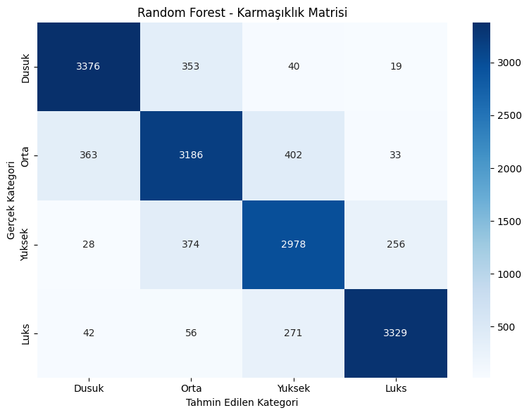
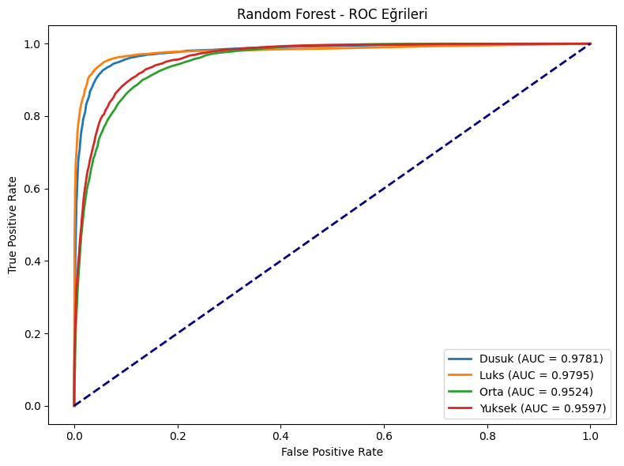
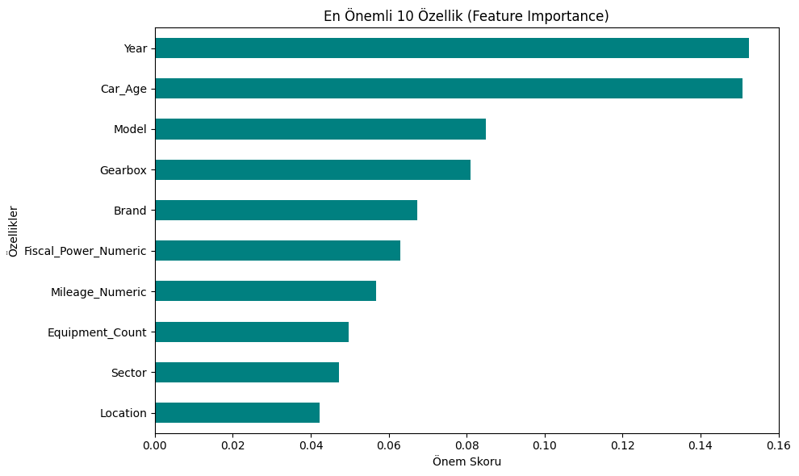

# MUCars Random Forest Fiyat Kategorisi Sınıflandırma

Bu proje BLM0463 Veri Madenciliğine Giriş dersinde dönem projesi olarak geliştirilmiştir.

Fas ikinci el araç pazarı (MUCars-2024) veri setinde Random Forest ile araç özelliklerinden fiyat kategorisi (Düşük / Orta / Yüksek / Lüks) tahmini.

## Veri Seti

- **Kaynak:** [Moroccan Used Cars Dataset (MUCars-2024)](https://data.mendeley.com/datasets/vjrbcb2rrt.2) — Data in Brief
- **Makale:** Tabarnoust, Mghari & Zaz (2025), *Data in Brief* 63, 112087
- **Dosya:** `cars_dataframe.csv` (101.896 kayıt, 15 sütun)
- **Eğitimde kullanılan:** ~75.526 kayıt (geçerli fiyat + aykırı değer temizliği sonrası)

## Görev

`Price` sütunundan türetilen 4 fiyat kategorisini tahmin etmek:

| Kategori | Fiyat aralığı (MAD) |
|----------|---------------------|
| Dusuk    | ≤ 60.000            |
| Orta     | 60.001 – 110.000    |
| Yuksek   | 110.001 – 170.000   |
| Luks     | > 170.000           |

## Kurulum

```bash
pip install -r requirements.txt
```

## Çalıştırma

```bash
python model_egitim.py
```

Çıktılar: `outputs/figures_simple/` klasörüne kaydedilir.

## Yöntem

- **Algoritma:** Random Forest Classifier (`n_estimators=100`)
- **Veri bölme:** %80 eğitim / %20 test (stratified)
- **Metrikler:** Accuracy, Sensitivity, Specificity, F-measure, ROC-AUC
- **Görseller:** Confusion matrix, ROC, feature importance, sınıf dağılımı, metrikler

## Sonuçlar (test seti, n=15.106)

### Genel metrikler

| Metrik               | Değer  |
|----------------------|--------|
| Accuracy             | 0.8519 |
| F-measure (macro)    | 0.8526 |
| F-measure (weighted) | 0.8520 |

### Sınıf bazlı metrikler

| Kategori | Precision | Sensitivity | Specificity | F-measure | ROC-AUC |
|----------|-----------|-------------|-------------|-----------|---------|
| Dusuk    | 0.888     | 0.891       | 0.962       | 0.889     | 0.978   |
| Orta     | 0.805     | 0.800       | 0.931       | 0.802     | 0.952   |
| Yuksek   | 0.800     | 0.819       | 0.936       | 0.813     | 0.960   |
| Luks     | 0.913     | 0.898       | 0.972       | 0.906     | 0.980   |

### Görselleştirmeler

**Karmaşıklık Matrisi**



**ROC Eğrileri**



**Özellik Önemleri (Top 10)**



## Referanslar

1. Tabarnoust, E., Mghari, M., & Zaz, Y. (2025). Moroccan used cars dataset. *Data in Brief*, 63, 112087.
2. Ayaou, A., El Otmani, F., & Atounti, M. (2026). Transparent AI for car Price Prediction. IRMA International.
3. Chamupaty, P. K., et al. Using Decision Tree and Random Forest Model. *JATIT*.
